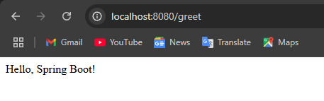
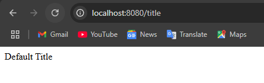
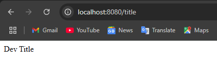
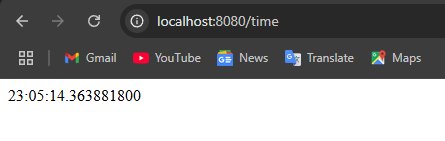
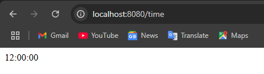

# Annotations Notes

## @SpringBootApplication(exclude = { DataSourceAutoConfiguration.class })

By excluding `DataSourceAutoConfiguration`, Spring Boot will not auto-configure an embedded H2 (or any) datasource.

This is useful when you want to run a Spring Boot app without database dependencies.

---

## @ConfigurationProperties(prefix = "app")

Binds external properties `application.properties` and `application-dev.yml` to strongly typed POJO (AppProperties.java).

---

## @Primary and @Qualifier

- `@Primary` marks the default bean when multiple candidates are present.
- `@Qualifier("mock")` selects a specific bean by name.

This enables choosing between different implementations via dependency injection.

## End Points

### Greet
`http://localhost:8080/greet`



---

### Title
`http://localhost:8080/title`

using the default title:



after adding:
```
spring.profiles.active=dev
```



---

### Time
`http://localhost:8080/time`

using the system time (primary):



after adding:
```java
@Autowired
public TimeController(@Qualifier("mock") TimeService timeService) {
    this.timeService = timeService;
}
```

